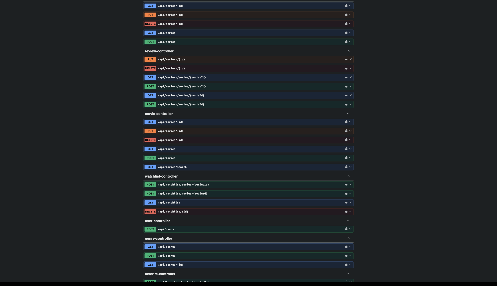
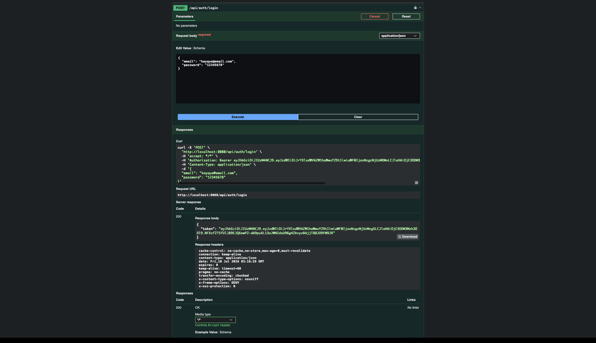
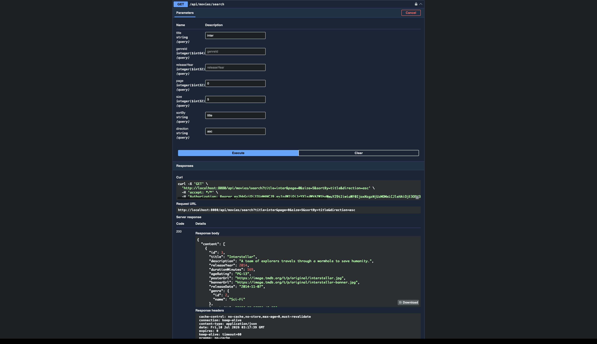
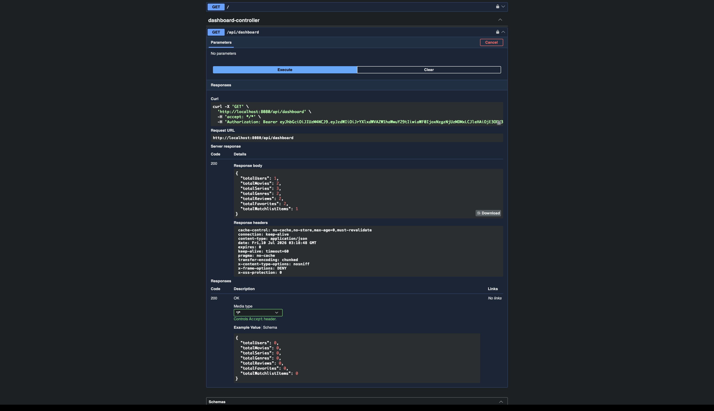
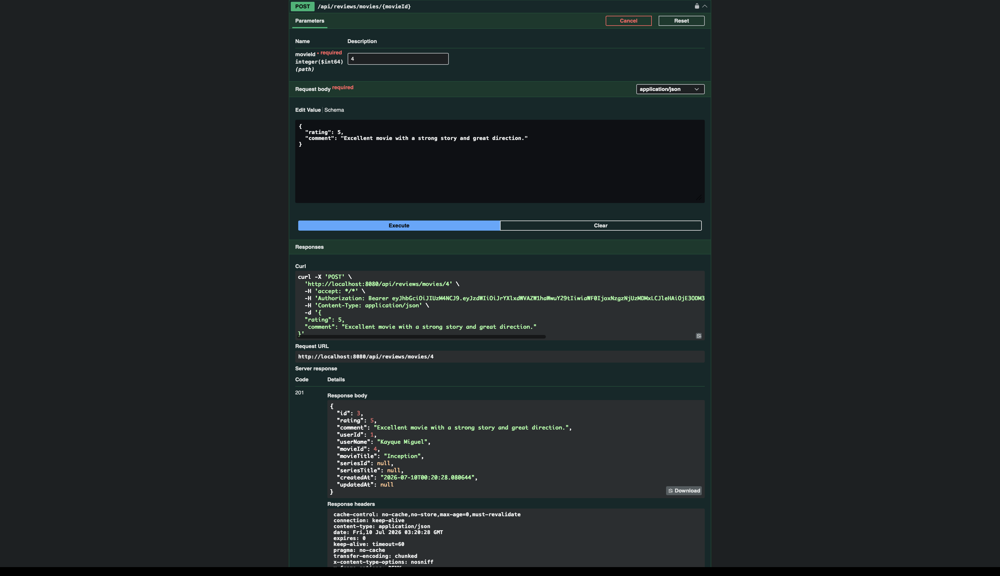
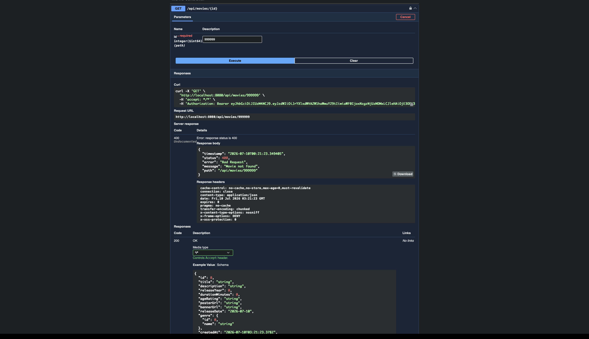

<div align="center">

# 🎬 StreamHub API

Backend de uma plataforma de streaming desenvolvido com **Java 21** e **Spring Boot**.

Autenticação JWT • Spring Security • JPA • MySQL • Swagger • REST API

<br>


</div>

---

##  Features

✔ JWT Authentication

✔ CRUD de Filmes

✔ CRUD de Séries

✔ CRUD de Gêneros

✔ Favoritos

✔ Watchlist

✔ Reviews

✔ Busca com filtros

✔ Paginação

✔ Ordenação

✔ Dashboard

✔ Global Exception Handler

---

---

#  Funcionalidades

### Autenticação

- Cadastro de usuários
- Login com JWT
- Senhas criptografadas com BCrypt
- Rotas protegidas

### Filmes

- Cadastro
- Atualização
- Exclusão
- Consulta por ID
- Listagem
- Pesquisa por título
- Pesquisa por gênero
- Pesquisa por ano
- Paginação
- Ordenação

### Séries

- Cadastro
- Atualização
- Exclusão
- Consulta
- Listagem

### Gêneros

- Cadastro
- Consulta
- Associação com filmes e séries

### Favoritos

- Favoritar filmes
- Favoritar séries
- Listar favoritos
- Remover favoritos

### Watchlist

- Adicionar filmes
- Adicionar séries
- Listar watchlist
- Remover itens

### Reviews

- Avaliar filmes
- Avaliar séries
- Atualizar avaliação
- Excluir avaliação
- Listar avaliações

### Dashboard

Retorna estatísticas gerais da plataforma:

- Total de usuários
- Total de filmes
- Total de séries
- Total de gêneros
- Total de avaliações
- Total de favoritos
- Total da watchlist

### Tratamento Global de Erros

Respostas padronizadas para exceções da API.

---

# Arquitetura

O projeto segue arquitetura em camadas.

```
Controller
     │
Service
     │
Repository
     │
Database
```

Também utiliza DTOs para entrada e saída de dados e Mappers para conversão entre entidades e respostas da API.

---

# Estrutura

```
src/main/java/com/kayque/streamhubapi

├── config
├── controller
├── dto
├── entity
├── exception
├── mapper
├── repository
├── security
├── service
├── validation
└── StreamhubApiApplication
```

---

# Autenticação

A autenticação é realizada utilizando **JWT (JSON Web Token)**.

Fluxo:

1. Criar um usuário
2. Fazer login
3. Receber um Token JWT
4. Utilizar o token nas rotas protegidas

Exemplo:

```
Authorization: Bearer TOKEN_JWT
```

---

# Endpoints

## Usuários

```
POST   /api/users
```

## Login

```
POST   /api/auth/login
```

## Filmes

```
GET    /api/movies
GET    /api/movies/{id}
GET    /api/movies/search
POST   /api/movies
PUT    /api/movies/{id}
DELETE /api/movies/{id}
```

## Séries

```
GET    /api/series
GET    /api/series/{id}
POST   /api/series
PUT    /api/series/{id}
DELETE /api/series/{id}
```

## Gêneros

```
GET    /api/genres
GET    /api/genres/{id}
POST   /api/genres
```

## Favoritos

```
GET    /api/favorites
POST   /api/favorites/movies/{movieId}
POST   /api/favorites/series/{seriesId}
DELETE /api/favorites/{id}
```

## Watchlist

```
GET    /api/watchlist
POST   /api/watchlist/movies/{movieId}
POST   /api/watchlist/series/{seriesId}
DELETE /api/watchlist/{id}
```

## Reviews

```
GET    /api/reviews/movies/{movieId}
GET    /api/reviews/series/{seriesId}

POST   /api/reviews/movies/{movieId}
POST   /api/reviews/series/{seriesId}

PUT    /api/reviews/{id}

DELETE /api/reviews/{id}
```

## Dashboard

```
GET /api/dashboard
```

---

# Como executar

## 1. Clone

```bash
git clone https://github.com/kayquemigueldev/streamhub-api.git
```

## 2. Entre na pasta

```bash
cd streamhub-api
```

## 3. Crie o banco

```sql
CREATE DATABASE streamhub_db;
```

## 4. Configure o application.properties

```properties
spring.datasource.url=jdbc:mysql://localhost:3306/streamhub_db
spring.datasource.username=root
spring.datasource.password=
```

## 5. Execute

```bash
./mvnw spring-boot:run
```

A aplicação ficará disponível em:

```
http://localhost:8080
```

---

# Swagger

```
http://localhost:8080/swagger-ui/index.html
```

## Página inicial



---

## Login JWT



---

## Busca de Filmes



---

## Dashboard



---

## Review criada



---

## Tratamento de Erros



---

# Exemplo de Pesquisa

```
GET /api/movies/search?title=inter&page=0&size=5&sortBy=title&direction=asc
```

Resposta:

```json
{
  "content": [
    {
      "id": 3,
      "title": "Interstellar",
      "releaseYear": 2014
    }
  ]
}
```

---

# Exemplo Dashboard

```json
{
  "totalUsers": 1,
  "totalMovies": 2,
  "totalSeries": 3,
  "totalGenres": 2,
  "totalReviews": 2,
  "totalFavorites": 2,
  "totalWatchlistItems": 1
}
```

---

#  Exemplo de Erro

```json
{
  "timestamp": "2026-07-10T00:04:12",
  "status": 400,
  "error": "Bad Request",
  "message": "Movie not found",
  "path": "/api/movies/999999"
}
```

---

# Autor

**Kayque Miguel da Fonseca Reis Galvão**

GitHub:
https://github.com/kayquemigueldev

---

- Projeto desenvolvido para estudos de **Java**, **Spring Boot**, **Spring Security**, **JPA**, **JWT** e boas práticas no desenvolvimento de APIs REST.